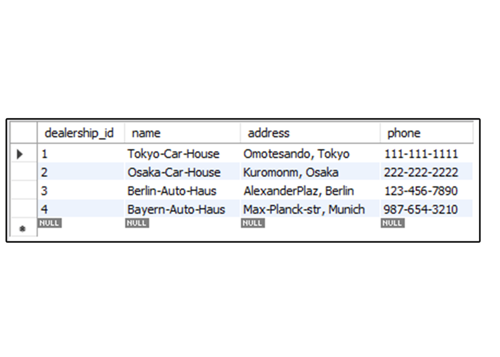
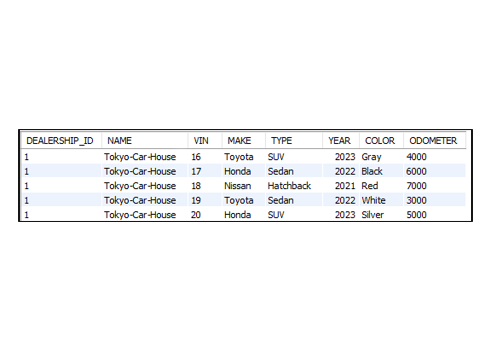
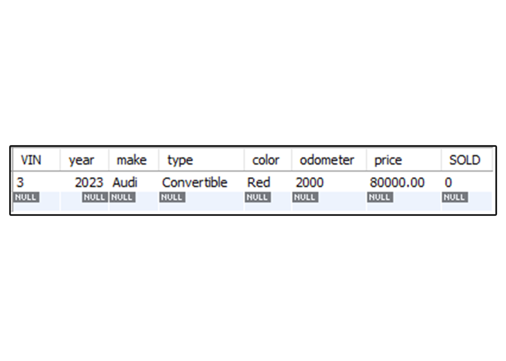
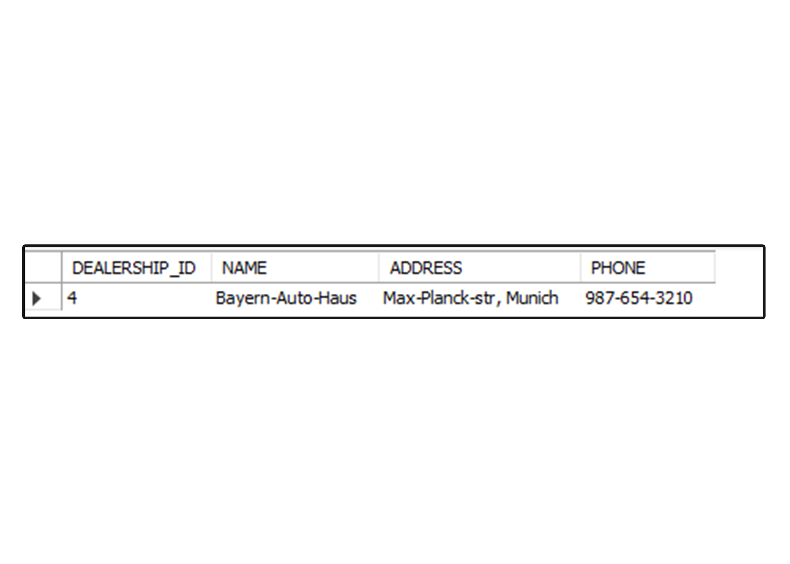
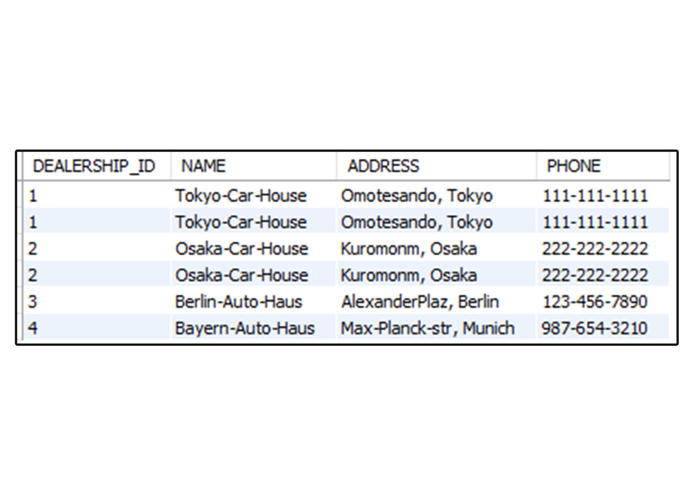
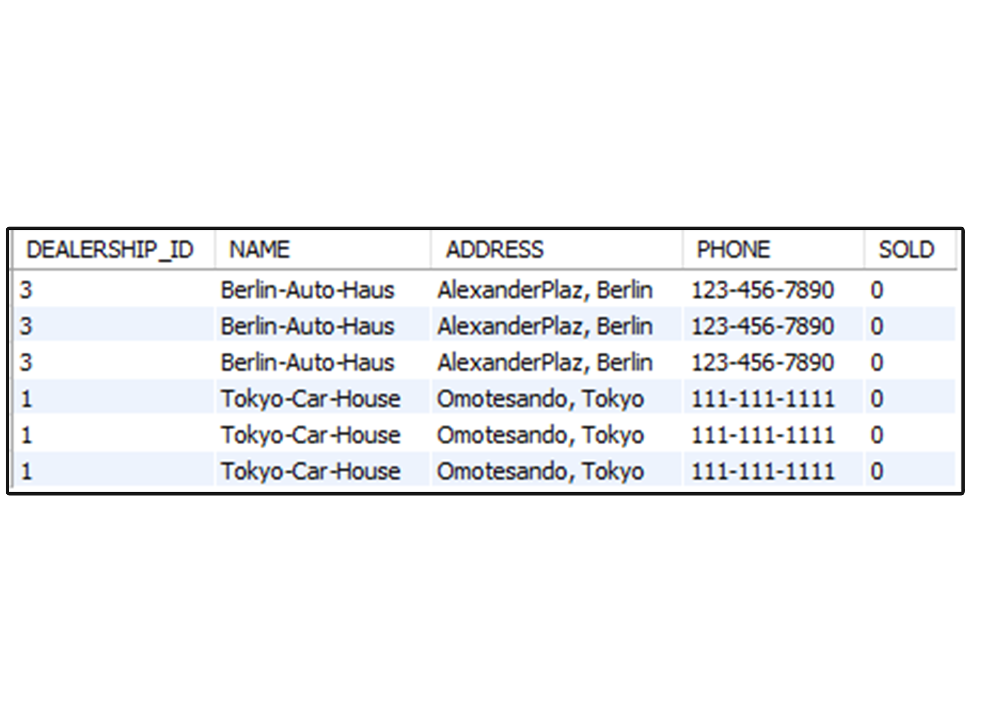
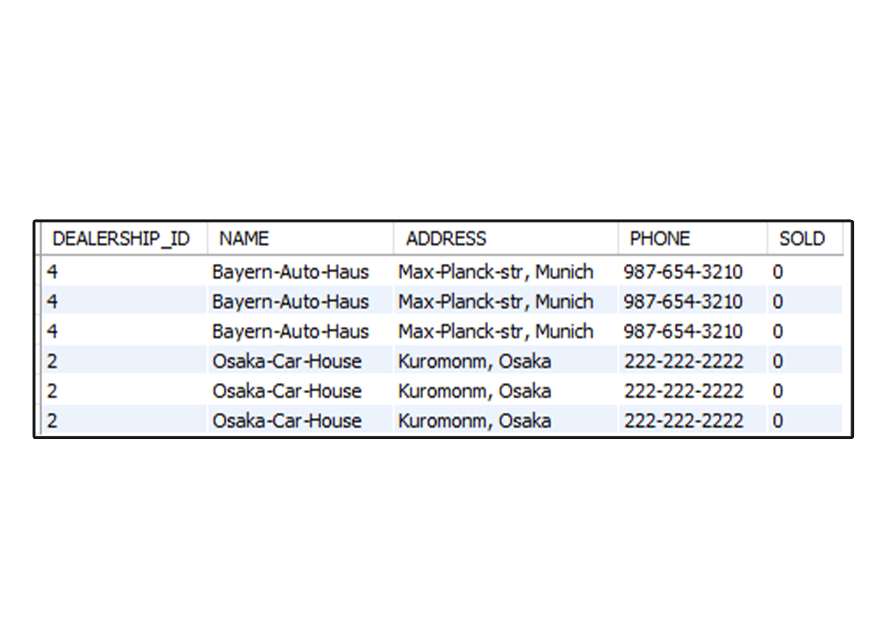

# VehicleHouse Database Schema 📝

This repository contains the SQL schema for the VehicleHouse database. The database schema is designed to manage vehicle inventory, dealerships, and sales/lease contracts.

## Introduction 📖

The VehicleHouse database schema is designed to store and manage information related to vehicle dealerships, vehicles, inventory, sales contracts, and lease contracts. It provides a structured representation of the data and enables efficient retrieval and manipulation of the information.

## Schema Overview 🤓

The schema consists of the following tables:

- **dealerships**: Stores information about dealerships, including dealership ID, name, address, and phone number.

- **vehicles**: Contains details about vehicles, such as VIN (Vehicle Identification Number), year, make, type, color, odometer reading, price, and sold status.

- **inventory**: Represents the relationship between dealerships and vehicles, specifying which vehicles are available at each dealership.

- **sales_contracts**: Stores information about sales contracts, including contract ID, VIN, date, client name, client email, recording fee, and sales tax.

- **lease_contracts**: Contains details about lease contracts, including contract ID, date, client name, client email, and VIN.

## Installation 📥

To use this database schema, you need a MySQL server installed on your machine. Follow these steps to set up the VehicleHouse database:

1.  Clone this repository to your local machine.
2.  Open a MySQL client (e.g., MySQL Workbench) and connect to your MySQL server.
3.  Create a new database named `vehicleHouse` by executing the following command: `CREATE DATABASE vehicleHouse;`
4.  Switch to the `vehicleHouse` database using the command: `USE vehicleHouse;`
5.  Execute the SQL script `vehicleHouse_schema.sql` to create the tables and populate them with sample data.

## Usage 🛠️

Once the database is set up, you can use it to perform various operations related to vehicle inventory, dealerships, sales contracts, and lease contracts. Here are some example queries you can run:

- Retrieve all dealerships:

  `SELECT * FROM dealerships;`

- Find all vehicles for a specific dealership:

  `SELECT D.dealership_id, D.name, V.vin, V.make, V.type, V.year, V.color, V.odometer FROM dealerships AS D JOIN inventory AS I ON D.dealership_id = I.dealership_id JOIN vehicles AS V ON I.vin = V.vin`
  `WHERE D.NAME = 'Tokyo-Car-House';`

- Find a car by VIN:

  `SELECT * FROM vehicles WHERE vin = 3;`

- Find the dealership where a certain car is located, by VIN:

  `SELECT D.dealership_id, D.name, D.address, D.phone FROM dealerships AS D JOIN inventory AS I ON D.dealership_id = I.dealership_id WHERE I.vin = 3;`

- Find all dealerships that have a certain car type (e.g., Sedan):

  `SELECT D.dealership_id, D.name, D.address, D.phone FROM dealerships AS D JOIN inventory AS I ON D.dealership_id = I.dealership_id JOIN vehicles AS V ON I.vin = V.vin WHERE V.type = 'Sedan';`

- GET ALL SALES INFORMATION FOR A SPECIFIC DEALER FOR A SPECIFIC DATE RANGE (LEASE CONTRACTS):

  `SELECT D.DEALERSHIP_ID, D.NAME ,D.ADDRESS, D.PHONE, V.SOLD`
  `FROM DEALERSHIPS AS D`
  `JOIN INVENTORY AS I`
  `ON D.DEALERSHIP_ID = I.DEALERSHIP_ID`
  `JOIN VEHICLES AS V`
  `ON I.VIN = V.VIN`
  `JOIN LEASE_CONTRACTS AS L`
  `ON L.VIN = I.VIN`
  `WHERE L.DATE BETWEEN '2023-06-03' AND '2023-06-05';`

- GET ALL SALES INFORMATION FOR A SPECIFIC DEALER FOR A SPECIFIC DATE RANGE (SALES CONTRACT)
  `SELECT D.DEALERSHIP_ID, D.NAME ,D.ADDRESS, D.PHONE, V.SOLD`
  `FROM DEALERSHIPS AS D`
  `JOIN INVENTORY AS I`
  `ON D.DEALERSHIP_ID = I.DEALERSHIP_ID`
  `JOIN VEHICLES AS V`
  `ON I.VIN = V.VIN`
  `JOIN SALES_CONTRACTS AS S`
  `ON S.VIN = I.VIN`
  `WHERE S.DATE BETWEEN '2023-06-03' AND '2023-06-05';`

Feel free to modify and extend the schema to suit your specific requirements.

## ScreenShots 🖼️

### Retrieve all dealerships

### Find all vehicles for a specific dealership

### Find a car by VIN

### Find the dealership where a certain car is located, by VIN

### Find all dealerships that have a certain car type (e.g., Sedan)

### GET ALL SALES INFORMATION FOR A SPECIFIC DEALER FOR A SPECIFIC DATE RANGE (LEASE CONTRACTS)

### GET ALL SALES INFORMATION FOR A SPECIFIC DEALER FOR A SPECIFIC DATE RANGE (SALES CONTRACTS)

# Contributing 🤝

Contributions to the VehicleHouse database schema are welcome. If you have any improvements or suggestions, please submit a pull request or
